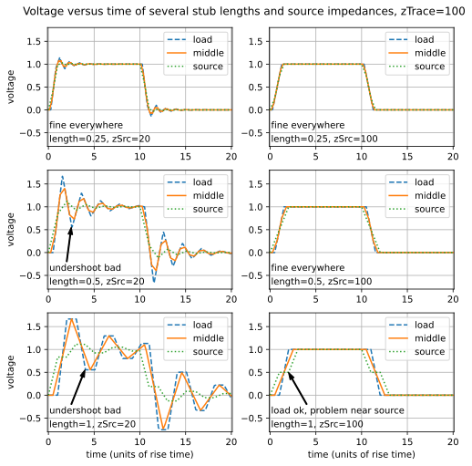

# ImpedanceMatching

## Show the effects of trace length, impedance, and rise time on electrical reflections

Analog and RF engineers understand transmission lines well, and they have many methods to match impedances. For high-speed digital designs with CMOS logic, the options are limited. For instance, parallel termination at the load can reduce reflections, but it also reduces the received voltage because of the voltage divider between the transmission line impedance and the termination. For CMOS logic, the only termination scheme that works is series termination at the source.

Below are simulations that show this is the case. The first simulations use a solution of the one-dimensional wave equation. The later simulations use the Python interface to LTSpice to show the effects of loads, different terminations, and splitting lines.

The wave equation in one dimension is (see [https://en.wikipedia.org/wiki/Wave_equation]()):

$$\frac {∂ ^2 V}{∂ t^2} = c^2 \frac {∂ ^2 V}{∂ x^2}$$

where 'c' is velocity (not necessarily the speed of light), and 'V' is voltage. The solutions to this equation are $V(x,t)=F(x-ct)+G(x+ct)$, which indicates the solution is composed of both a left-going wave and a right-going wave. For a uniform lossless transmission line, we can assume these two waves travel in their respective directions unaffected by the transmission line. That means if we have an array rightWave[0:N-1] with the voltages of the right-going wave at positions on the transmission line, then at the future time Δt=Δx/v, rightWave[1:N-1] = rightWave[0:N-2]. If the time steps and position steps do not line up perfectly, then linear interpolation can be used. The same logic tells us that leftWave[0:N-2] = leftWave[1:N-1]

All the interesting things happen at the beginning and end of the transmission line. At the right end, near the load, there is no source, so the last element of the left-going wave is the reflection coefficient times the last element of the right-going wave, leftWave[N-1] = $Γ_{term}$*rightWave[N-1], where 

$$Γ_{term} = \frac {Z_{term} - Z_{trace}}{Z_{term} + Z_{trace}}$$

See [https://en.wikipedia.org/wiki/Reflection_coefficient]() and [https://en.wikipedia.org/wiki/Reflections_of_signals_on_conducting_lines](). At the left end of the transmission line near the source we similarly have the rightWave[0] = $Γ_{src}$*leftWave[0], but we are looking into the source, so

$$Γ_{src} = \frac {Z_{src} - Z_{trace}}{Z_{src} + Z_{trace}}$$

In addition we have the source voltage, which presumanbly changes with time, and it affects the right-going wave through a voltage divider composed of 

$$rightWave[0] = \frac {V_{src}(t)}{1 + \frac{Z_{src}}{Z_{trace}}}$$

The voltage at each point on the transmission line is the sum of the right and left waves at that point.

The plots below show the voltage on a transmission for a square-like voltage source with a linear ramp for the rising and falling edges. The edge rate of the ramp is 1, and the propagation speed is also 1. These can be scaled trivially. If the edge rate of interest is 2nS, and the propagation speed is 150mm/nS, then a scaled length of 0.25 has a physical length of 0.25 * 150mm/nS * 2nS = 75mm. Similarly, 20 on the horizontal time axis means 20*2nS = 40nS. These are typical numbers for CMOS drivers on a PCB. Use something like [https://saturnpcb.com/saturn-pcb-toolkit/]() to determine more exact propagation speeds. The three graphs on the right have source impedances matched to the transmission line impedance. The three on the left have source impedances that is typical of the output impedance for CMOS outputs, and the undershoot with a length of 0.5 * $t_{rise}$ is likely to cause problems for a CMOS input.

The two animated GIFs below are the same data as above, but instead of plotting V versus time, they show V versus position. The transmission line lengths are 0.25, 0.5, and 1 x $t_{rise}$. The Python code to create these plots is in the file [MakeWaves.py](https://github.com/mmignard/ImpedanceMatching/blob/main/MakeWaves.py)

## Finding source impedance

## LTSpice simulations

Exactly the results are obtained with LTSpice simulation as with the previous left- and right-going wave simulations, as shown in the plot below.

The code that generated this plot using LTSpice is in (https://github.com/mmignard/ImpedanceMatching/blob/main/TlineLTSpice.py). LTSpice is a little slower, but the advantage is it is much easier to play with different termination schemes. For instance, the plot above was created using the LTSpice schematic shown here:

